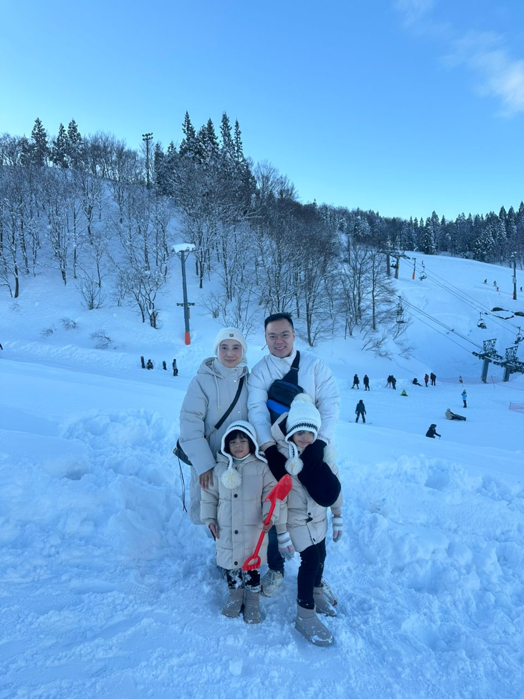
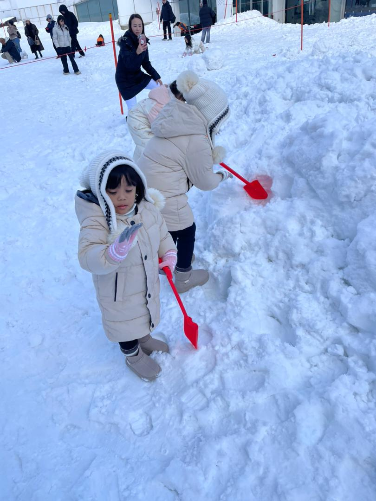
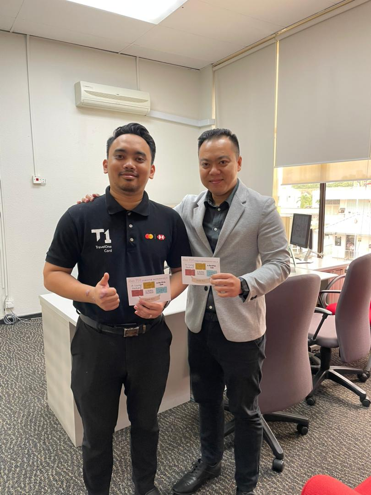

<!DOCTYPE html>
<head><title>biodata</title>
<meta charset="utf-8">
<meta name="viewport" content="Website">
</head>
<body>
<header>
<a href="index.html">
    

    

</a>
</header>

<nav>
    

<table cellspacing="6" cellpadding="6">
<tr>
<td><a href="home.html">Home</a></td>
<td><a href="biodata.html">Biodata</a></td>
<td><a href="experience.html">Experience</a></td>
<td><a href="family.html">Family</a></td>
<td><a href="gallery.html">Gallery</a></td>
</tr>
</nav>
</table>

    

<h3 style="font-size:150%;">MY PERSONAL SPACE<h/h3>

<table>
<tr>
<td bgcolor="brown"="center">
<header>

<h2 style="font-size:100%;">"Hello !! I'm Yasin, a curious man in the world, always eager to explore new paths and create something unique. I'm always seeking new adventures for the mind and soul. I believe that life is an ever-evolving story, and I'm here to add my own chapter filled with passion, growth, and endless possibilities. Join me on my personal website as I will share all about my self. </h2>
</a>

	
</header>
</td>
</tr>
<tr>
<td>

</style>

</td>	
</tr>
</table>

<footer>
<b>"I am becoming the best version of myself"

</footer>
</body>

<audio controls autoplay>
  <source src="song.ogg" type="audio/ogg">
  <source src="song.mp3" type="audio/mpeg">
</audio>

</body>
</html>

<!DOCTYPE html>
<head><title>biodata</title>
<meta charset="utf-8">
<meta name="viewport" content="Website">
</head>
<body>
<header>
<a href="index.html">
    

    

</a>
</header>

<nav>
    

<table cellspacing="6" cellpadding="6">
<tr>
<td><a href="home.html">Home</a></td>
<td><a href="biodata.html">Biodata</a></td>
<td><a href="experience.html">Experience</a></td>
<td><a href="family.html">Family</a></td>
<td><a href="gallery.html">Gallery</a></td>
</tr>
</nav>
</table>

    

<h3 style="font-size:150%;">MY PERSONAL SPACE<h/h3>

<table>
<tr>
<td bgcolor="brown"="center">
<header>

<h3 style="font-size:250%;">About Me</h3>
</a>

	
</header>
</td>
</tr>
<tr>
<td>

<b>Regardless of how you feel inside

Always try to look like a winner"

Don't let anyone dim your light</b>

 My name is Yasin bin Lotfi Low. You can call me Yasin or whatever you like 

 A passionate individual who enjoys learning new things and sharing knowledge 

 I love exploring new experience, traveling, and meeting new people. 

 Currently working as Branch Manager at Affin Bank Kota Bharu. 

 My Goal through this year is to constantly learn and grow in this banking industry and hoping to make my family more happier. 

</td>	
</tr>
</table>

<footer>
<b>"You have to believe in yourself when no one else does"

</footer>
</body>

<audio controls autoplay>
  <source src="song.ogg" type="audio/ogg">
  <source src="song.mp3" type="audio/mpeg">
</audio>

</body>
</html>

<!DOCTYPE html>
<head><title>biodata</title>
<meta charset="utf-8">
<meta name="viewport" content="Website">
</head>
<body>
<header>
<a href="index.html">
    

    

</a>
</header>

<nav>
    

<table cellspacing="6" cellpadding="6">
<tr>
<td><a href="home.html">Home</a></td>
<td><a href="biodata.html">Biodata</a></td>
<td><a href="experience.html">Experience</a></td>
<td><a href="family.html">Family</a></td>
<td><a href="gallery.html">Gallery</a></td>
</tr>
</nav>
</table>

    

<h3 style="font-size:150%;">MY PERSONAL SPACE<h/h3>

<table>
<tr>
<td bgcolor="brown"="center">
<header>

<h3 style="font-size:250%;">About Me</h3>
</a>

	
</header>
</td>
</tr>
<tr>
<td>

<b>A dream doesn't become reality 

through magic, it takes sweat,

determanation and hard work</b>

The only way to do great work is to love what you do. If you haven't found it yet, keep looking. Don'tsettle

As you know in our life, we must have something that we want to achieve
 

So never stop dreaming, because dreaming is applicable to all of us

Before becoming a what I am today, what i can say don't be afraid to give your best

If you do the little jobs well =, the big ones will tend take care of themselves

</td>	
</tr>
</table>

<footer>
<b>"It always seems impossible until it's done"

</footer>
</body>
<!DOCTYPE html>
<head><title>biodata</title>
<meta charset="utf-8">
<meta name="viewport" content="Website">
</head>
<body>
<header>
<a href="index.html">
    

    

</a>
</header>

<nav>
    

<table cellspacing="6" cellpadding="6">
<tr>
<td><a href="home.html">Home</a></td>
<td><a href="biodata.html">Biodata</a></td>
<td><a href="experience.html">Experience</a></td>
<td><a href="family.html">Family</a></td>
<td><a href="gallery.html">Gallery</a></td>
</tr>
</nav>
</table>

    

<h3 style="font-size:150%;">MY PERSONAL SPACE<h/h3>

<table>
<tr>
<td bgcolor="brown"="center">
<header>

<h3 style="font-size:250%;">About Me</h3>
</a>

	
</header>
</td>
</tr>
<tr>
<td>

<b>Ohana means Family

Family means no one

Gets left behind or forgotten</b>

I come from a wonderful and supportive family. My beautiful wife, Che Nurwahida

who have always encouraged me to follow my dreams, to push my limit, make me believe in myself more.
 

Without her support I can't get what I have right now. I'm very grateful for what I have

I have two daughter who inspire and give spirit to me every day with their jokes

You don't choose your family. They are God's gift to you, as you are to them

</td>	
</tr>
</table>

<footer>
<b>"Time Together as a family is a gift"

</footer>
</body>

<audio controls autoplay>
  <source src="song.ogg" type="audio/ogg">
  <source src="song.mp3" type="audio/mpeg">
</audio>

</body>
</html>

<!DOCTYPE html>
<head><title>biodata</title>
<meta charset="utf-8">
<meta name="viewport" content="Website">
</head>
<body>
<header>
<a href="index.html">
    

    

</a>
</header>

<nav>
    

<table cellspacing="6" cellpadding="6">
<tr>
<td><a href="home.html">Home</a></td>
<td><a href="biodata.html">Biodata</a></td>
<td><a href="experience.html">Experience</a></td>
<td><a href="family.html">Family</a></td>
<td><a href="gallery.html">Gallery</a></td>
</tr>
</nav>
</table>

    

<h3 style="font-size:150%;">Hope you enjoy my personal website :)<h/h3>

<table>
<tr>
<td bgcolor="brown"="center">
<header>

<h3 style="font-size:250%;">My Gallery</h3>

</a>

	
</header>
</td>
</tr>
<tr>
<td>

<b> Feel free to take a glimpse of my daily life working and my family photo 

My picture at Affin Kota Bharu Branch

My two beautiful kids enjoying our trip school holiday. InshaAllah more trips to enjoy

Picture with my regular customer

</style>

</style>

</td>	
</tr>
</table>

<footer>
<b>"Hope you will enjoy your life everyday"

</footer>
</body>
